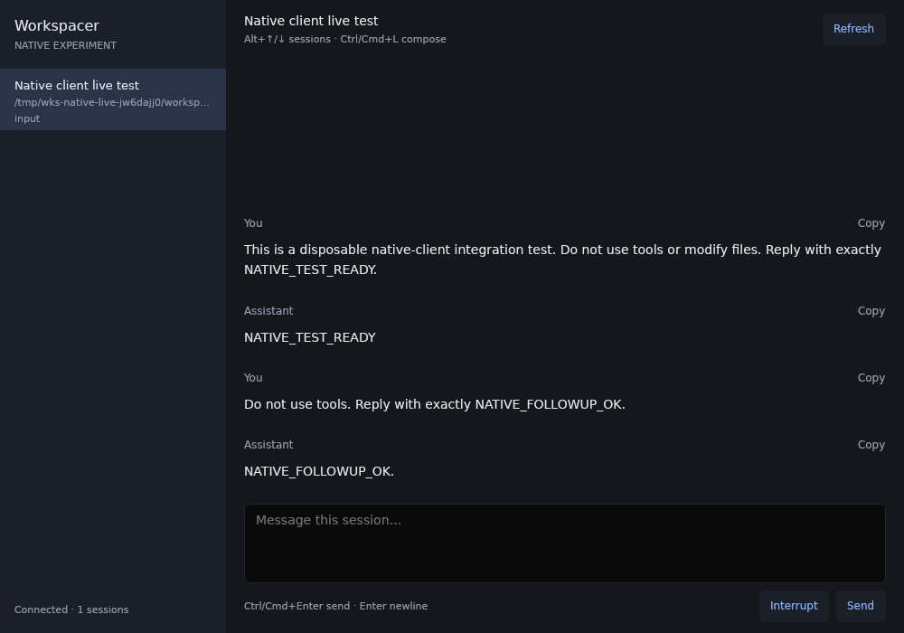
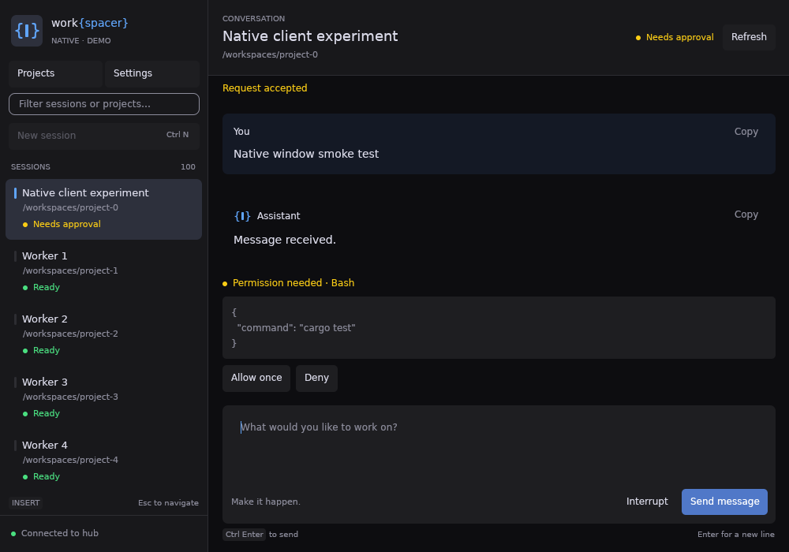

# Workspacer Native

Experimental GPUI client with an existing-hub mode and an embedded local backend.
Rust renders the interface directly; no Electron, browser, or webview is used. GPUI and
GPUI Component are pinned together; the optional component webview feature is
disabled. Local mode embeds both claudemon and the shared Rust hub/backend library.
The same backend runs independently through `workspacer-rust serve`.

## Windows installer

The release workflow now builds
`Workspacer-Native-Rust-Preview-Setup-<version>-x64.exe` alongside Electron artifacts.
The unsigned preview has manual updates and a separate Start menu shortcut,
uninstall registration, notification identity, and data directory. This preserves
existing installations while the Rust migration is tested.

The package contains the native application, standalone `workspacer-rust.exe`,
plugin examples and Visual C++ runtime DLLs. It does not bundle Go services,
`desktop-host.cjs`, or a private Node runtime. Agent CLIs, Git and any runtimes
required by external providers/plugins remain separate prerequisites.

The shortcut starts `--local`, which owns the backend in process and uses
`%LOCALAPPDATA%\Workspacer Native Rust Preview`. `--rust-local-dir` selects
another isolated directory. Bare launches still connect to an existing hub;
`--bus` explicitly selects one. Uninstall preserves application data.

To reproduce on Windows x64:

```powershell
cargo build --locked --release --manifest-path apps/native/Cargo.toml --bin wks-native --bin native-harness
cargo build --locked --release --manifest-path services/hub-rs/Cargo.toml --bin workspacer-rust
# Install NSIS 3 and select Visual Studio's redistributable x64 CRT directory.
$env:NATIVE_CRT_DIR = 'C:\path\to\Microsoft.VC143.CRT'
node apps/native/scripts/package-windows.mjs
$version = (Get-Content apps/desktop/package.json | ConvertFrom-Json).version
./apps/native/scripts/test-windows-installer.ps1 -Installer "apps/desktop/release/Workspacer-Native-Rust-Preview-Setup-$version-x64.exe"
```

Node 22 is a packaging tool dependency. CI resolves a checksum-verified NSIS
compiler using `scripts/resolve-nsis.mjs`; manual builds can set `MAKENSIS`.
The smoke test requires a disposable Windows user. It checks install/upgrade,
payload hashes, the shortcut, installed standalone CLI, embedded backend readiness,
joined shutdown and uninstall/data retention with Node absent from PATH. It does
not launch a provider or verify GPU rendering. The installed `build-stamp.json`
records the release version and source SHA.

`.github/workflows/rust-native-preview.yml` also builds an isolated artifact on
relevant PRs or manual dispatch. That validation workflow does not publish a
release or update the nightly. A successful preview build alone does not establish
complete migration parity.

## Run

Use a current stable Rust toolchain. On Debian/Ubuntu, install the native build
dependencies first:

```sh
sudo apt-get install libxkbcommon-dev libxkbcommon-x11-dev libfontconfig1-dev libwayland-dev libssl-dev libasound2-dev libvulkan1 mesa-vulkan-drivers
```

macOS needs Xcode command-line tools; Windows needs the MSVC Rust toolchain and
Visual Studio C++ build tools. Linux needs a working X11/Wayland display and
Vulkan driver. The CI workflow builds/tests all three platforms; local validation
results are recorded separately below.

From the repository root (connects to the running desktop hub or `workspacer serve`):

```sh
make dev-native     # build and launch the debug GUI against an existing hub
make build-native   # build apps/native/target/release/wks-native
make run-native     # build and launch the release GUI against an existing hub
make test-native    # native UI/protocol and embedded-engine lifecycle tests
```

Use **New session** (`Ctrl/Cmd+N`), choose Claude or Codex, and enter an existing
absolute project directory on the connected hub. A name and first message are
optional. Choose a model from the searchable picker or keep Provider default.
Custom model accepts an exact ID or alias. **Create session** opens the real agent
conversation; permissions start at Ask to approve. Claude also offers Accept
edits, Plan mode, and Full access; Codex offers Ask to approve and Full access.
The provider CLI must be installed and signed in on the hub. Failed launches retain the form. If the connection drops
before acknowledgement, refresh the session list before retrying to avoid a
duplicate. An unconfirmed first message is retained as a composer draft.

Claude choices come from the hub's family-alias catalog, grouped into one row per
family with separate context-window choices. Labels do not infer version numbers
from old transcripts, and historical model IDs are not presented as available
models. Codex choices come from the hub's live provider catalog for the entered
project directory. Refresh models retries the query (the hub may serve its cache).
Loading failures leave Provider default and Custom model available; switching
providers clears incompatible model/context choices and resets permissions to Ask.
These are provider-native permissions, separate from Workspacer plugin access.

The launch targets connect to an existing hub by default; use `--local` to own a
local backend.
For a different hub, pass `ARGS="--bus wss://host/bus --token-file /path/to/token"`.
Demo mode remains explicitly opt-in with `ARGS="--demo"`; creation is disabled there.
The native targets are also included in the root `build`, `test`, and `clean` targets.

From `apps/native`:

```sh
# Isolated demo: 100 sessions, 1,000 transcript entries, simulated streaming.
# Does not read credentials, launch agents, or call a model.
cargo run --locked -- --demo

# Connect to an already running desktop hub or workspacer serve.
cargo run --locked --release -- --bus ws://127.0.0.1:7895/bus

# Remote hub. Credentials are carried in an Authorization header.
cargo run --locked --release -- --bus wss://my-host/bus --token-file /path/to/token

# Open a specific session, without falling back to another session if absent.
cargo run --locked -- --session SESSION_ID
```

`WKS_HUB_BUS` can supply the URL. Credentials resolve from `--token-file`, then
`HUB_TOKEN`, then the existing Workspacer `remote-token` file **only for loopback
URLs**. Config directory rules match the existing clients (`APPDATA` on Windows;
`XDG_CONFIG_HOME`, otherwise `~/.config`, on Unix including macOS). Local credentials
are never automatically forwarded to an explicitly remote hub.

The client connects to existing sessions and creates sessions via `agents.spawn`.
Existing-hub mode does not own or stop backend processes on exit. The connected hub needs a provider for `sessions.snapshots`,
`sessions.conversation`, `agents.sendMessage`, `claude.approve`, `claude.answer`,
`claude.signal`, and `agents.spawn`.

## Embedded local backend

The default Cargo build includes `rust-hub`. These repository targets build and
start the native app with its owned Rust backend:

```sh
make dev-native-local       # debug build and launch
make run-native-local       # release build and launch
make build-native-local     # build without launching
make dev-native-local ARGS="--keep-running"
```

`--local` owns the Rust hub, MCP facade and claudemon engine on a dedicated backend
thread. UI commands and events use the in-process hub, including session controls,
launch preparation, configuration and provider projections. There is no separate
Go supervisor or direct-engine bypass in the native backend adapter.

Existing-hub connections remain the no-argument default. `--bus` and `--demo`
do not start a local engine. `--rust-local-dir` selects another isolated owned
backend; both local spellings exclude a remote bus or token file.

Local state remains under **Workspacer Native Rust Preview** in the platform's
local-data directory. The engine, bus and facade use allocated loopback ports.
Legacy service-bundle/database overrides and nondefault hub/MCP port flags are
refused; use an isolated directory instead. Cooperating Rust backend owners hold
an exclusive canonical database lease through joined shutdown. An unconfirmed
shutdown retains that reservation until its process exits. The standalone
`claudemon` command does not participate in this sidecar protocol.

Native startup opts into best-effort manual Claude hook installation/retargeting
under the chosen home directory. Managed stream launches retain their driver
telemetry independently. Startup and owned-service failures are shown in the UI.

Closing the window quits by default. `--keep-running` minimizes instead, retaining
the same owner. Explicit Quit shuts down and joins the hub and engine, including
owned provider processes. External/remote services remain externally owned.

For a repeatable startup/catalog/shutdown smoke without launching agents:

```sh
cargo run --locked --manifest-path apps/native/Cargo.toml \
  --no-default-features --features rust-hub --bin native-harness -- \
  rust-probe --directory /tmp/wks-native-smoke
```

Use a fresh directory. The probe uses a fixture home and explicitly disables
account polling, verifies controller/catalog readiness, joins shutdown, and
checks the four actual listener receipts are released. `embedded-probe` is an
alias for this Rust probe and takes the same `--directory` argument. It prints no
credentials, launches no model provider, and does not verify visible GPU output.

## First slice

Captured during a real Codex round trip through an isolated backend:



- Virtualized session sidebar with workspace paths and status.
- Selected conversation, selectable Markdown/code, per-message copy.
- Streaming messages, composer drafts per session, approvals, free-text answers,
  and interrupt controls. Failed/unknown-outcome sends preserve their drafts.
- Reconnection, snapshot reseeding, delta-gap recovery, and stale-response guards.
- `Alt+Up/Down` switches sessions; `Ctrl/Cmd+L` focuses the composer;
  `Ctrl/Cmd+Enter` sends; plain Enter inserts a newline; `Ctrl/Cmd+R` refreshes.
- Scrollback retains its position while new text arrives. Jump to latest resumes
  following the conversation.

This experiment intentionally starts with the connected hub's own sessions.
Federated/paired rows are excluded so a remote session cannot accidentally be
controlled through an unqualified local method. Terminal emulation, federation, and full theme parity remain follow-on work.
Transcript rendering is described below.

## Rich conversation display

- Consecutive tool calls form collapsible work groups. Results attach to their
  call IDs, including empty results and failures. Expanded calls show input,
  output, read content, and colored edit/unified-patch diffs with copy controls.
  Skill, subagent and workflow calls have specialized labels and use reported
  inventory/status when the connected backend supplies it.
- User messages preserve literal text. Assistant messages retain Markdown/code;
  Markdown file targets open a guarded, read-only preview on the connected host.
  Image attachment markers and mentioned image paths load host-backed thumbnails.
  Missing/unsupported previews leave the original text visible.
- Sent messages remain visibly provisional until a new authoritative user turn
  acknowledges them. Messages sent during work say **Queued**. Failed or uncertain
  sends preserve the existing draft behavior; acceptance alone does not remove
  the provisional bubble.
- Reading positions persist per hub/session, including the viewport offset and
  last-read content. Session switches, empty attach snapshots and background
  updates preserve them. **New activity** jumps to the first unread location;
  **Jump to latest** resumes following. Bookmarks are capped at 200 sessions.
- Each turn has a changed-files summary. Observed live turn completion captures
  repository counts; historical turns and unavailable/committed files use clearly
  labelled estimates from successful tool calls. Captures are client-local and
  bounded, like Electron's transient snapshot cache.
- Fleet wakes show worker links, reply prefills and result/escalation blocks,
  with the complete original wake available. Reply actions preserve your draft.
- Closed assistant `wks-html-card` fences render inert native text/tables and
  explicit **Open worker**, **View diff**, and **Prefill** buttons. Worker actions
  validate the parent relationship; diff reads use the existing owner-validated
  service. Prefill never sends. CSS, JavaScript and browser-only HTML are not
  executed; the required fallback text remains readable. Tool output and user
  text never activate response-card actions.

Live chat retains its 2,000-row / 4 MiB budget, including tool payloads. History
uses the same message renderer and retains full server-provided tool inputs and
outputs. Long text is paginated as literal text instead of splitting Markdown
fences into misleading fragments. The server's existing retention/frame limits
still apply.

For a repeatable visual fixture without an agent or model call:

```sh
cargo run --locked --bin native-harness -- serve --bind 127.0.0.1:17996 --sessions 3 --turns 0 --rich-transcript
# In another terminal:
cargo run --locked --bin wks-native -- --bus ws://127.0.0.1:17996/bus
# Linux/X11 automation against that fixture:
python3 scripts/smoke.py --bus ws://127.0.0.1:17996/bus --no-input --scroll-pages 10
```

Choose **Dark**, **Light**, or **Nord** under **Settings → Appearance**.
Switching applies immediately to the chrome, brand mark, conversation, inputs,
and Markdown/code theme without changing sessions or composer drafts. These
palettes follow the Electron themes (Light uses a darker warning color for
readability). The choice persists in `workspacer/native-theme.json` under
`XDG_CONFIG_HOME` (otherwise `~/.config`) or `APPDATA` on Windows. This is a local
client preference, separate from the hub's `config.yaml`. An unreadable or invalid
preference falls back to Dark with a startup diagnostic; failed saves are shown
in Settings while keeping the selected theme active for the current run.

The brace-and-cursor mark and work{spacer} wordmark follow `components/Brand.tsx`.
Controls retain text labels, and native platform monospace fonts render the mark.
Custom Electron themes, automatic system appearance, and bundled web fonts are
not supported by this picker yet.

## Projects, settings, and keyboard navigation

**Projects** groups the connected hub's sessions by their exact directory paths.
Full paths distinguish projects with the same folder name. Save an absolute path
for a project without sessions; opening it pre-fills New Session, without launching
an agent until you submit the form. Paths are interpreted on the hub, not checked
against the client's filesystem. **Unsave** removes only the bookmark; projects
with live sessions stay listed. Bookmarks are scoped to the hub endpoint.

Opening a project filters the session sidebar; **All** clears the project filter.
The sidebar search matches session names/paths and project paths. Keyboard
navigation follows the filtered list and keeps the highlighted row in view.

**Settings** contains the theme picker, a Vim navigation toggle, a default-agent
picker (Claude/Codex), and the shortcut reference. Keyboard preferences, default
provider, and project bookmarks persist in `workspacer/native-settings.json`
next to `native-theme.json`. These are local client preferences; the shared hub
configuration and running agents are unaffected. Missing settings use defaults;
invalid files produce a startup diagnostic. Save errors are shown in the view.

Vim navigation is enabled by default. The sidebar shows **NORMAL** when navigation
has focus and **INSERT** when a text field has focus. Text fields retain ordinary
editing; this is Vim-style app navigation, not a modal text editor.

| Keys | Action |
| --- | --- |
| `Esc` | Leave a text field; press again to return to the conversation |
| `j` / `k` | Next / previous session or project |
| `gg` / `G` | First / last session or project |
| `i` | Focus composer, new-session project field, or saved-project path field |
| `/` | Focus the sidebar filter |
| `g p` / `h` | Projects |
| `Enter` / `l` | Open the highlighted project |
| `g s` | Settings |
| `g c` | Conversation |
| `n` | New session using the selected project's directory |
| `Ctrl+U` / `Ctrl+D` | Scroll conversation by half a window |
| `t` / `v` / `a` in Settings | Cycle theme / toggle Vim / switch default agent |
| `Ctrl/Cmd+P` | Projects, including with Vim disabled |
| `Ctrl/Cmd+,` | Settings, including with Vim disabled |
| `Ctrl/Cmd+Enter` | Send, create a session, or save the focused project-path field |

The existing `Ctrl/Cmd+N`, `Ctrl/Cmd+L`, `Ctrl/Cmd+R`, and `Alt+Up/Down` shortcuts
remain available. Settings and Projects never send a hidden composer draft.

[Projects preview](docs/ui-projects.png) · [Settings preview](docs/ui-settings.png)

## Everyday workflows

The conversation stays the main workspace. **Changes**, **History**, **Session…**,
and **Model…** open secondary views without sending or discarding the composer draft.
At short window sizes, the approval command stays visible while full details can
be expanded, and attachment controls share the composer action row.

- **Session history** lists the hub’s recent sessions. Open reads an existing
  conversation; Resume opens a launch form with its identity, known model/context,
  and Ask permissions. Creation is explicit. Claude and Codex resumes are supported.
  **Session…** renames, archives/restores, and offers a confirmed **End session**;
  Interrupt remains a separate control. Names and archives are client-local and
  scoped to the connection. Archiving does not stop an agent or delete history.
- **Changes** shows the current repository’s staged, unstaged and untracked files.
  Select a file’s change type to read its colored unified diff. This is working-tree
  state, including edits outside the selected session, not an attribution claim.
  Errors, clean trees and binary/no-text diffs have separate messages. Display is
  capped at 3,000 diff lines with an explicit notice.
- **Agent setup** is available in Settings, the welcome state and the launch form.
  It reports installed CLIs and allows an explicit connection check (which may use
  provider allowance). Sign-in stays with each CLI. A setup detour preserves a
  pending resume. Local mode offers a native project-folder picker; remote paths
  remain paths on the hub machine.
- **History** browses the server’s retained conversation in pages of 50 chunks.
  Long messages are split on UTF-8 boundaries into labeled 32 KiB parts instead of
  silently losing their beginning. The snapshot is independent of live chat.
  Server-trimmed history is labeled; this cannot recover events the server no
  longer retains. History responses use the existing 16 MiB bus frame limit.
- **Settings → Workspace** includes notifications and a persistent keep-running
  preference. Closing can minimize while local agents continue; explicit Quit
  still stops the owned backend. Completion, approval and question transitions
  notify when the window is inactive, without replaying historical alerts on
  connection. OS settings still govern delivery. The Windows installer registers
  a dedicated Workspacer Native notification identity.
- **Attach…** accepts images and PDFs up to 8 MiB. Paste image or normal Ctrl/Cmd+V
  accepts clipboard screenshots; TIFF/BMP clipboard images are converted to PNG
  off the UI thread with decode limits. Windows also supports native bitmap
  clipboard fallback. Attachments are uploaded to the connected hub, remain bound
  to their original session, and stay in the draft after failed/uncertain sends.
  Remove discards a draft attachment; uploaded files follow the hub’s retention.
- **Question choices** support single and multiple selections and custom answers.
  Labels and typed numbers are sent literally. **Model…** applies a selected model
  and context to the running session; queued changes are reported as queued.
- **Settings → Updates** shows the installed build version and can query the latest
  stable GitHub release. Downloads/release notes open in the browser; updates are
  installed manually.

Normal-mode shortcuts: `g h` session history, `g d` changes, `g a` setup,
`g e` session actions, and `g m` model. `Esc` returns from a secondary view;
text inputs retain ordinary editing and paste behavior.

[Changes preview](docs/ui-changes.png) · [Setup at minimum size](docs/ui-setup.png) · [Compact approval](docs/ui-compact-approval.png)

## Visual design and captures

The native workspace uses inset session rows with activity badges, theme preview
swatches, a centered conversation column, and a single composer surface. Short
windows compact the header, approval details, and composer to preserve transcript
space. Without a selected session, the welcome state takes the full content area.
New-session fields and long approval details remain scrollable.

Current fixture captures (Linux/X11, software Vulkan; synthetic sessions):



[Light conversation](docs/ui-light.png) · [Nord at 720 × 480](docs/ui-nord.png) ·
[Welcome state](docs/ui-empty.png)

The visual pass was checked in all three themes, including the minimum window
size and the creation form. All 36 native tests passed, including 13 GPUI tests.
These captures do not establish macOS/Windows appearance or GPU performance.

Repeat the capture with an isolated appearance preference:

```sh
python3 scripts/smoke.py --binary target/debug/wks-native --theme light --output light.png
python3 scripts/smoke.py --binary target/debug/wks-native --theme nord --width 720 --height 480 --output compact.png
# Against an isolated native-harness serve fixture (no agent/model calls):
python3 scripts/smoke.py --binary target/debug/wks-native --bus ws://127.0.0.1:7896/bus --new-session --output create.png
python3 scripts/smoke.py --binary target/debug/wks-native --screen projects --no-input --output projects.png
python3 scripts/smoke.py --binary target/debug/wks-native --screen settings --theme light --no-input --output settings.png
# --no-input captures the current view without sending a fixture message.
```

## Performance boundaries

- Network/JSON work lives in an owned background Tokio runtime, off the GPUI UI
  thread; local mode also gives the embedded engine its own runtime.
- Subscribe to one selected conversation; release its topic on selection changes.
- UI updates use a single-slot latest-value mailbox, capped at approximately
  30 updates/second during streaming. The controller publishes no unchanged idle
  snapshots; GPUI manages cursor and platform repainting.
- Transcript: at most 2,000 rows / 4 MiB of retained text, with a 64 KiB per-row
  cap. Clipping is labeled. These are text-storage bounds, **not total RSS limits**.
- Immutable rows share allocations across frames. Only changed row measurements
  are invalidated; GPUI lays out visible transcript/sidebar rows.
- Bounded command/event queues, frame-size limits, call deadlines, and reconnect
  backoff. Mutations are never automatically replayed after connection loss.
- A proven push path suppresses fast polling. A 30-second reconciliation catches
  provider restarts and removed sessions; older providers fall back to a
  one-second selected-conversation fetch.

## Feedback loop

```sh
# Fast core/protocol suite: works without a display or GUI libraries.
cargo test --locked --no-default-features

# Optional, read-only check of real hub contracts. Prints only counts.
cargo run --locked --no-default-features --bin native-harness -- probe --token-file /path/to/token

# GPUI's deterministic window/input harness plus all protocol tests.
cargo test --locked --features ui-tests
cargo clippy --locked --all-targets --features ui-tests -- -D warnings
cargo fmt --check

# Optimized reducer + immutable-frame handoff measurement, JSON output.
cargo run --locked --release --no-default-features --bin native-harness -- bench --events 20000

# Separate fixture process for measuring the UI's own RSS/CPU.
cargo run --locked --no-default-features --bin native-harness -- serve --sessions 1000 --turns 5000
cargo run --locked --release -- --bus ws://127.0.0.1:7896/bus

# Linux: real native window + keyboard input + PNG, with RSS/CPU observations.
# Requires xdotool and libX11; xvfb-run can provide a display in CI.
python3 scripts/smoke.py --binary target/release/wks-native
```

Protocol tests use actual loopback WebSockets, including deliberate disconnects,
missing deltas, a snapshot racing an event, and a delayed response after switching
sessions. GPUI tests exercise real key dispatch, Unicode composition, late send
receipts, and the number of rows constructed for a 2,000-entry transcript.
The fixture has no provider side effects. Tests against it do not prove live
Claude/Codex behavior or remote TLS/account configuration.

An explicit live-provider harness is available separately. It launches **one real
agent** in an existing absolute scratch directory, sends two short no-tool prompts,
verifies assistant output through the production controller, verifies a fresh
client can reconstruct the conversation, then sends SIGTERM to that session.
It requires an authorized operator credential and may incur provider usage:

```sh
cargo run --locked --no-default-features --bin native-harness -- live \
  --token-file /path/to/authorized-token --cwd /absolute/scratch-directory
```

`--provider codex` selects Codex; the default is Claude. `--keep-open` deliberately
leaves the disposable session available for window inspection with `--session`;
the caller then owns termination. The harness never retries an uncertain spawn.
An unknown-outcome spawn without an ID requires inspecting the backend before
retrying. Live mode is never invoked by demo, automated tests, or CI.

On Linux, `scripts/live-stack.py` can own the whole disposable stack instead of
using an existing hub. It requires installed `workspacer`, `hub`, `brain`, and
`claudemon` binaries plus an authenticated provider CLI. It chooses unused
loopback ports, uses temporary config/SQLite/plugin directories, skips global
hook installation, explicitly disables the tool facade for these no-tool prompts,
waits for capability registration, and shuts the stack down:

```sh
python3 scripts/live-stack.py --harness target/debug/native-harness --provider codex
# Also capture the real conversation in the native window (DISPLAY + xdotool):
python3 scripts/live-stack.py --harness target/debug/native-harness \
  --provider codex --native target/release/wks-native --output native-live.png
```

These commands make real model calls. Their isolated hub credential is private
to the temporary directory; they do not rotate or broaden the existing hub's
credentials. Provider authentication/history still belongs to the invoking user.

The benchmark reports reducer time, snapshot handoff time, and retained text.
It deliberately does not call those values GPU frame latency or startup time.
For comparisons with Electron, run both clients against the same backend and
workload, measuring client RSS, total-stack RSS, idle CPU, cold startup, and
input/scroll latency separately. Use release binaries on representative hardware.

On Linux, compare already-running clients without restarting them (use Electron's
main PID, not a renderer PID):

```sh
python3 scripts/compare-clients.py --native-pid NATIVE_PID --electron-pid ELECTRON_PID --seconds 20
```

This reports sampled CPU and proportional RAM (PSS, which apportions shared pages).
It includes Chromium child processes and any open DevTools, excludes separate
backend/build processes, and does not measure GPU memory. Electron's in-process
host services remain included. Match builds, displayed conversations and window
visibility before treating the result as a controlled efficiency comparison.

The X11 smoke script drives focus, resize, typing and send, then captures native
pixels and fails on a blank window. It reports window-appearance time (not time
to first usable frame), sampled RSS, and idle CPU. Its default in-process demo
includes fixture memory; `--bus` selects a separately running fixture for cleaner
client-only measurements. Software Vulkan and debug builds are useful correctness
checks, not representative performance results.

Independent review found and corrected oversized string-capacity retention,
snapshot/reset ordering (including separate event/reply queues), the asynchronous
subscription-readiness gap, and virtual-list invalidation when revisions restart.
Each has a regression test. A GUI keyboard test also caught and corrected the
composer's Enter binding taking precedence over the send shortcut.

## Code map

| File | Responsibility |
| --- | --- |
| `src/bus.rs` | Socket ownership, authentication, subscriptions, deadlines, reconnects |
| `src/model.rs` | Session projection and bounded, sequence-aware transcript reducer |
| `src/controller.rs` | Selection, RPC lifecycle, snapshot/event reconciliation, UI mailbox |
| `src/ui.rs` | GPUI views, virtualization, keyboard dispatch, drafts |
| `src/ui/navigation.rs` | Projects/settings views, shared navigation and focus handling |
| `src/navigation.rs` | Project grouping and persistent native preferences |
| `src/harness.rs` | Isolated protocol fixture |
| `src/live.rs` | Explicit disposable live-provider exercise |
| `src/bin/native-harness.rs` | Repeatable fixture and benchmark commands |
| `tests/protocol.rs` | Wire-level and controller regressions |

Rivet/Witness may initially report these new files as unmapped. That is not a
test pass; run the complete native-client suites above.

## UI commands from the hub

The controller subscribes to `facade.openTerminal` and the supported `command.*`
topics. It retains up to 32 bounded display requests until a visible workspace
consumes them. A headless controller never turns these events into a process,
agent launch or claim that a pane opened. Foreign-hub commands are excluded;
pending requests are discarded on disconnect rather than replayed on reconnect.

The native equivalents use existing screens:

| Request | Native behavior |
| --- | --- |
| `command.focus_agent` | Focus an available local session; preserve pinned windows. |
| `command.open_spawn_dialog` | Prefill the new-session form with `cwd`; user confirmation still creates the session. |
| `command.open_pane` with `claude` | Open the new-session form with Claude selected. |
| `settings`, `sessions` / `recentagents` | Open Settings or Session history. |
| `review` | Open Changes for the requested project directory. |
| `agents` / `agentwatch`, `inspector` | Open the conversation/session list or selected-session details. |
| `command.run_action` | Apply supported session navigation, new-session form, settings, review and inspector actions. Decision and session-control verbs are refused. |

Native has no terminal pane, browser pane, plugin renderer, guide pane, library,
analytics dashboard, board, editor, Ask or context pane. Requests for those
surfaces show an explicit unsupported notice. The most recent unsupported terminal request retains `cwd`,
`command`, `label` and `parentSessionId` behind **Copy request**; no hidden shell
is created and the command is not run. Guide requests offer an explicit link to
native documentation. These are pre-existing native UI gaps, not substitutes for
the Rust backend's working terminal or data APIs.

UI commands retain their existing fire-and-forget bus contract. The native
client does not publish a fabricated visible-pane acknowledgement. Protocol and
controller tests cover dispatch and refusal; they do not establish visual
appearance or full browser/desktop pane parity.

A repeatable nonvisual check is:

```sh
cargo run --locked --manifest-path apps/native/Cargo.toml --no-default-features --bin native-harness -- ui-intent-probe
```

It uses a local fixture WebSocket, confirms the native subscriptions and retained
terminal/spawn-dialog intents, and refuses any unexpected backend mutation.

## Intentional server stop

A WebSocket close with code `4001` pauses native reconnection, including when it
arrives before the hub greeting. Calls and background reconciliation cannot wake
the server while paused. **Reconnect and wake** (or the existing Refresh command)
is an explicit user action; pending mutations are never replayed. Reconnect gestures are tied to the pause
the user saw, so a delayed click cannot override a newer stop request. A pause confirms
the server's request to disconnect, not that its cloud stop has completed.

An in-process pause retains the owning backend and reports its typed close reason.
It does not create a replacement hub or stop the embedded engine merely because a
viewer paused. Restarting that connection remains the embedding host's explicit
responsibility; the native library does not infer OS shutdown or restart authority.
